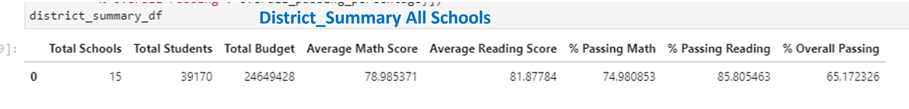
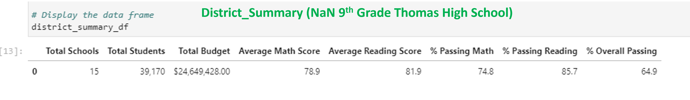
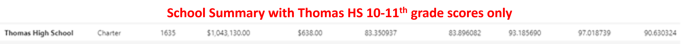
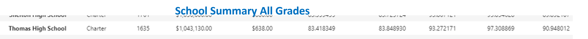
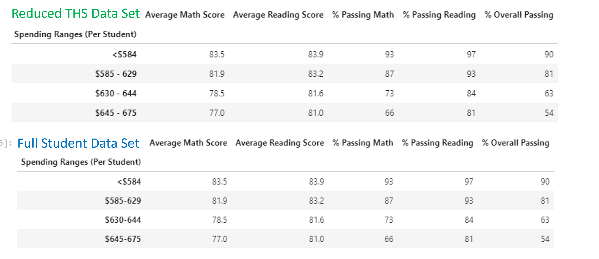
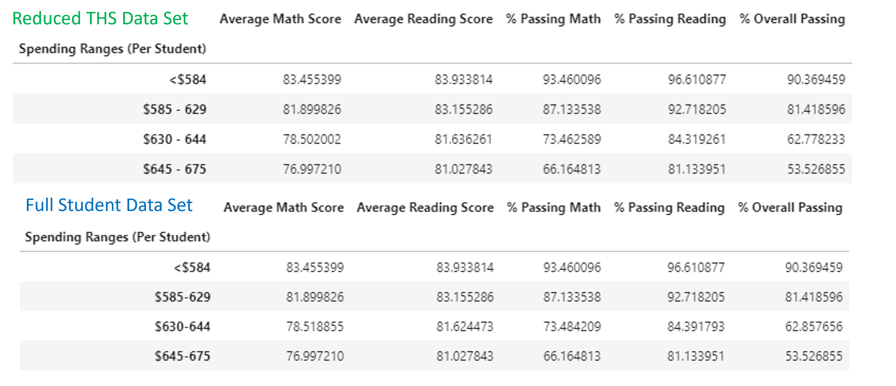
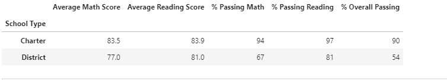

# School-District-Analysis

## Overview of Project

Assist Maria, the Chief Data Scientest , in providing analysis on all schools within the district to identify patterns and trends by reviewing test scores and see if score performance can be linked to size of schools, type of schools, and the amount of money in the school budget and per capita basis.  This analysis will assist school board members in making decisions regarding funding and resource allocations.

### Purpose

During the analysis of the schools in the district and their performance on standardized testing in relationshipe to school type, budget, and size, it was communicated by the school board that there were signs of academic dishonesty; specifically reading and math grades for the ninth grade students at Thomas High School.  Due to the inability to discern the full extent of the academic dishonesty, the school board asked Maria to replace the reading and math scores for the entire 9th grade of Thomas High School with NaN and rerun the overally analysis and see what impact this would have on the analysis.

## Results

The district analysis was orginally completed without bias including all scores from all schools taken calculated in the analysis.  However, because of academic disnhonesty as it relates to the 9th grade scores at Thomas High School, the analysis was run two additional times.  Once, to return results based on score removal for Thomas High School ninth grade but, maintaining the Thomas High School population intact. Then once again focusing only on the 10th, 11th, and 12th grade population of Thomas High School.  The resulting summary can be found below.

### Code Modifications Made

Setting Thomas High School 9th grade scores to NaN

Removing Thomas High School 9th grade from the data set and only include Thomas High School grades tenth, eleventh, and twelfth for revised calculations.

### Analysis of District Summary

Upon running the District Analysis between data sets that include all students scores and scores that did not include math and reading scores for ninth graders at Thomas High School, the following can be observed:

* The Average Math Score dropped by .1% for the district when Thomas High School ninth graders scores were not calculated.
* The % Passing Math dropped by .2% for the district when Thomas High School ninth graders scores were not calculated.
* The % Passing Reading dropped by .1% for the district when Thomas High School ninth graders scores were not calculated.
* The % Overall Passing dropped by .3% for the district when Thomas High School ninth graders scores were not calculated.
* Special Note: To be consistent with formattng, the original full data output was re-formatted to include to the tenth decimal place.
* Please see images below for full District Analysis between full data set and data set where Thomas High School scores were not calculated.
 

### Analysis of School Summary

When accessing Thomas High School ninth grade math and reading scores, it has a big impact on Thomas High Schools % Overall Passing data point by dropping it to 65.1%.  This is understandable as the scores were removed but the calculations were done on the entire student body.  However when the analysis was redone but, only taking into consideration Thomas High Schools 10th, 11th, and 12th grade students scores and the respective student population, that changes were minimal when compared to the entire district.
 
 * % Overall Passing for Thomas High School students, excluding 9th grade was 90.63% when compared to the 90.95% average when the analysis was run including the suspect 9th grade data. While the district's % Overall Passing score was 65.2%
 * % Passing Reading showed a decline of .29% for Thomas High School students when the suspect ninth grade scores were removed when compared to the original data set.  
 * Average Math Scores and % Pass Math each showed less than .1% decline for the 9th grade excluded data set compared to the original data set.
 * Average Reading Scores showed less that .1% improvement for the 9th grade excluded data set compared to the orginal data set.
 * Please see a scaled down school summary below

### Overal Summary of Impact of Thomas High School analysis with removal of 9th grade scores
The overall impact to the District Analysis and School Analysis with the removal of Thomas High School 9th grade from the entire data set is minimal.  With 39,170 students in the district, the removal of the Thomas High School 9th grade population, which is only 461 students, from the data set has a minimal impact.  Infact, using standard formatting of extending the accuracy of the output to either zero or one significant digit yielded no change at all.  The formatting had to be extended to two significant digits before yielding and diferenece at all.  Below are two screen shots that show comparison of data sets with standard formatting as recommended through the exercise and then with the extension of accuracy to two significant digits.

As you can see above, there is no difference in the formatted data set with the removal of the 9th grade Thomas High School poplution from the data set. One would have to go to the unformatted data set as seen below to identify slight differences in results when comparison the reduced student data set to the full student population data set.

The remainder of this report will be analyzing the the district performance when broken down by factors such as spending, size of school and type of school.

### Analysis of School Spending
After dividing the per capita spend into four brackets, one could make the determination that the amount of money spent per student does not necessarily yield better performance when it comes to student scores. In fact, in cases where the per capita spent was less that $584 dollars, the schools actually performed better that those schools that spent more per student on every category.  On the other end of the spectrum, schools that spent the most on a per capita basis actually performed worse than those that spent less on each category.  See screen snippet below:

### Anaylsis of School Size

When doing an analysis on school size and its impact on test performance, the following can be interpretted:
* Mediucm schools with 1000 - 2000 students had the highest overall percentage for passing and percentage passing reading
* Small schools with less than 1000 students were on par with medium schools for Average Reading Score, percentage passing math, but exceeded medium schools in Average Math Scores.
* Schools with more that 2000 students trailed the schools with smaller population sizes in every metric listed.
* Please see image below for reference.

### Anaylsis of School Type

This analysis was also seperated out by reading and math scores performance when compared to school types. The two types of schools that were analyzed were Charter and District schools.  Looking at the snippet below, one could interpret the results as Charter schools tend to outperform District Schools in each category.  Charter schools performed better than District schools when it came to Average Math Score, Average Reading Score, % Passing Math, % Passing Reading, % Overall Passing.

### Suumary

After Assigning NaNs to the 9th grade population at Thomas High School the District Summary displayed the following changes
* The average math score dropped by .1% for the data set assigning Thomas High School ninth grade scores to NaN
* The average reading score remained unchanged when compared to the data set assinging Thomas High School ninth grade scores to NaN
* % Passing math dropped by .2% for the data set assigning Thomas High School ninth grade scores to NaN
* % Passing reading dropped by .1% for the data set assigning Thomas High School ninth grade scores to NaN
* The % Overall Passing dropped by .3% from 65.2% to 64.9% after assigning Thomas High School ninth grade scores to NaN
* Special note, analysis noted above was pulled from reports that was set to one significant digit.
 
